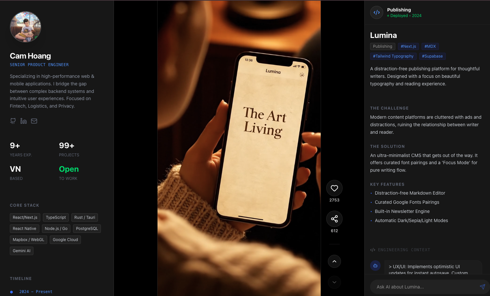

# 🎥 DevReels Portfolio

> A modern, cinematic portfolio template inspired by TikTok/Reels.
> Showcase your work with vertical video feeds, interactive AI chat, and a sleek dark-mode UI.



## ✨ Features

- **📱 Cinematic Feed**: Infinite vertical video scrolling with snap physics and keyboard navigation.
- **🤖 Context-Aware AI**: Integrated "Lead Developer" persona (powered by Gemini 1.5 Flash) that answers technical questions about each specific project.
- **⚡ High Performance**: Built on Next.js 16 (App Router), Server Actions, and React Server Components.
- **🎨 Premium UX**: Minimalist dark mode, glassmorphism interactions, and fluid Framer Motion animations.
- **🛠 Realistic Case Studies**: Pre-configured structure for detailed project deep-dives (Problem, Solution, Tech Stack).

## 🚀 Tech Stack

- **Framework**: Next.js 16 (App Router)
- **Styling**: Tailwind CSS
- **Animation**: Framer Motion
- **AI Integration**: Google Generative AI (Gemini)
- **Icons**: Lucide React
- **Deployment**: Vercel ready

## 📦 Getting Started

### 1. Clone the repository
```bash
git clone https://github.com/yourusername/devreels.git
cd devreels
```

### 2. Install dependencies
```bash
npm install
```

### 3. Environment Setup
Create a `.env.local` file in the root directory and add your Google Gemini API key:
```env
GOOGLE_API_KEY=your_gemini_api_key_here
```

### 4. Run the development server
```bash
npm run dev
```

Open [http://localhost:3000](http://localhost:3000) with your browser to see the result.

##  customization

- **Projects Data**: Edit `lib/data.ts` to update your portfolio items, video links, and case study details.
- **Profile Info**: Update `components/reels/ProfileSidebar.tsx` with your own bio and avatar.
- **Videos**: Place your vertical demo videos (9:16 aspect ratio) in the `public/reels/` folder.

## 📄 License

This project is open source and available under the [MIT License](LICENSE).

---

Built with ❤️ by [Cam Hoang](https://github.com/camhm)
